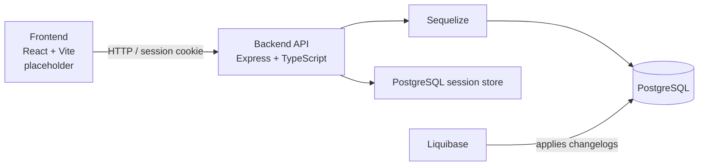

# Shreddeded

**Shreddeded** is a full-stack fitness-tracking project focused on the fundamentals behind a practical gym and nutrition companion: secure accounts, personal food libraries, and a database model designed to grow into meal, workout, and progress tracking.

> **Project status:** The backend currently provides authentication, user management, and food management endpoints. The database schema also lays the groundwork for nutrition, workout, exercise, and weight-log features. The frontend is intentionally left as a placeholder while the API foundation is developed.

## Highlights

- Session-based authentication with secure, HTTP-only cookies
- User registration and profile management, including admin-only user listing
- Personal food catalogue with calorie and macronutrient data
- Request validation with Zod and interactive OpenAPI documentation
- PostgreSQL persistence through Sequelize
- Versioned, repeatable database schema changes with Liquibase
- Docker Compose environment for the API, client, database, and migrations
- API safeguards including Helmet headers, CORS, rate limiting, structured errors, request IDs, and logging

## Architecture



## Technology

| Area | Tools |
| --- | --- |
| Backend | Node.js, TypeScript, Express 5 |
| Database | PostgreSQL 16, Sequelize, `pg` |
| Migrations | Liquibase |
| Validation & API docs | Zod, `@asteasolutions/zod-to-openapi`, Swagger UI |
| Authentication | `express-session`, `connect-pg-simple`, bcrypt |
| Frontend | React 19, Vite, TypeScript *(placeholder)* |
| Local infrastructure | Docker, Docker Compose |

## Repository layout

```text
.
├── backend/                  # Express API and domain modules
│   └── src/
│       ├── modules/          # Auth, user, and food features
│       ├── middleware/       # Authentication, validation, errors, logging
│       └── config/openapi/   # OpenAPI registration and endpoint definitions
├── db-migration/
│   └── liquibase/changelogs/ # Versioned PostgreSQL schema changes
├── frontend/                 # React/Vite client (placeholder)
└── docker-compose.yml        # Local multi-container environment
```

## Getting started

### Prerequisites

- [Docker Desktop](https://www.docker.com/products/docker-desktop/) with Docker Compose
- Node.js 20+ and npm, if you prefer running the backend or frontend outside Docker

### 1. Configure environment variables

Create a `.env` file at the repository root. Do not commit it.

```env
POSTGRES_DB=shreddeded
POSTGRES_USER=postgres
POSTGRES_PASSWORD=choose-a-strong-password
SECRET_KEY=replace-with-a-random-secret-of-at-least-32-characters
FRONTEND_URL=http://localhost:5173
```

`PORT` and `NODE_ENV` are optional; the API defaults to `3000` and `development`.

### 2. Provide the Liquibase PostgreSQL driver

The Docker Compose migration service expects the PostgreSQL JDBC driver at:

```text
db-migration/liquibase/drivers/postgresql-42.7.10.jar
```

Download the matching driver from the [PostgreSQL JDBC project](https://jdbc.postgresql.org/download/) and place it in that directory. The JAR is ignored by Git so the repository stays lightweight.

### 3. Start the stack

```bash
docker compose up --build
```

This starts PostgreSQL on host port `5434`, runs Liquibase migrations once the database is healthy, exposes the API at `http://localhost:3000`, and serves the frontend at `http://localhost:5173`.

Useful checks:

```bash
# API health check
curl http://localhost:3000/health

# Stop containers while retaining database data
docker compose down
```

To reset local database data, use `docker compose down -v` deliberately; this removes the named PostgreSQL volume.

## API overview

Interactive API documentation is available at [`/api-docs`](http://localhost:3000/api-docs) in non-production environments. It is the source of truth for request and response details.

| Resource | Endpoints | Access |
| --- | --- | --- |
| Health | `GET /health` | Public |
| Authentication | `POST /auth/login`, `POST /auth/logout` | Login is public; logout requires a session |
| Users | `POST /users`, `GET/PUT/DELETE /users/:id` | Registration is public; remaining routes require a session |
| User search | `GET /users` | Admin only |
| Foods | `GET/POST /foods`, `GET/PUT/DELETE /foods/:id` | Authenticated users |

Authentication uses a server-side session stored in PostgreSQL. Browser clients should send requests with credentials enabled so the session cookie is included.

### Example: register and sign in

```bash
# Create an account
curl -X POST http://localhost:3000/users \
  -H "Content-Type: application/json" \
  -d '{
    "email": "alex@example.com",
    "username": "alexlifts",
    "password": "a-strong-password",
    "height": 180
  }'

# Sign in and store the session cookie
curl -X POST http://localhost:3000/auth/login \
  -H "Content-Type: application/json" \
  -c cookies.txt \
  -d '{"emailOrUsername":"alex@example.com","password":"a-strong-password"}'
```

## Data model and direction

The current schema supports more than the endpoints exposed today:

- **Users and weight logs** for profiles and progress history
- **Foods, meal logs, meal items, and nutrition goals** for nutrition tracking
- **Exercises, workout sessions, workout exercises, and workout sets** for gym logging

The API presently implements the user, authentication, and food portions. Meal, workout, exercise, and progress endpoints are planned extensions rather than advertised as finished features.

## Frontend

> **Frontend placeholder**
>
> The `frontend/` directory contains the initial React + Vite setup. Its product UI, client-side state, authenticated API integration, and user flows are still to be implemented. This section will be replaced with screenshots, feature notes, and local frontend instructions as the client takes shape.

## Running services without Docker

For backend development, install dependencies and start the watcher from the backend directory. You will need a running PostgreSQL instance, a valid `DATABASE_URL`, and the same environment variables described above.

```bash
cd backend
npm ci
npm run dev
```

The frontend can be started independently:

```bash
cd frontend
npm ci
npm run dev
```

## Development notes

- Database changes belong in a new Liquibase changelog and should be included from `db.changelog-master.xml`.
- API request validation lives beside each backend module, keeping input contracts close to the feature that owns them.
- Production configuration enables secure session cookies; serve the API over HTTPS in that environment.
- No automated test suite has been added yet. API behavior can be exercised through Swagger UI or an HTTP client while the project evolves.